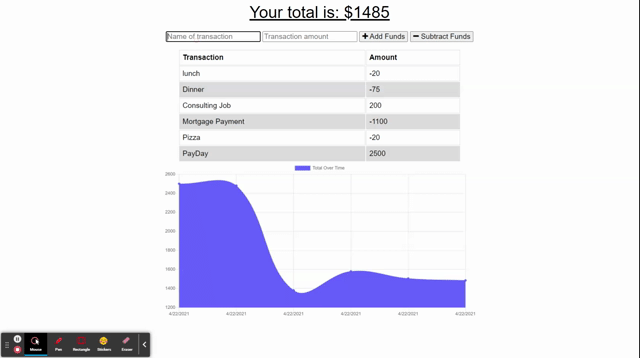
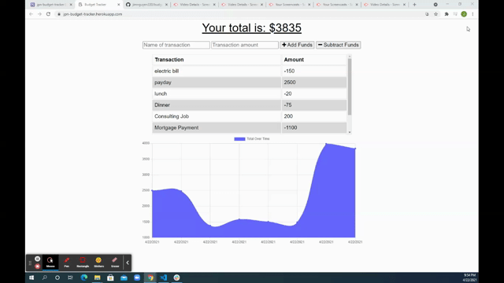

# budget-tracker

* [Installation](#installation)
* [Heroku](#Heroku)

------------------------------------

## Description

Progressive Web App that you can use offline to track your budget.  While offline, the user is able to store deposits and withdrawals using IndexedDB.  Once back online, this information is pushed to the database and is cleared from IndexedDB.

Another unique feature of this application is that it is downloadable with complete functionality while offline.  All the    

### Technologies used

* IndexedDB
* MongoDB
* Progressive Web App (PWAs)
* Service Workers
* Node.js
* Express

------------------------------------
  
  ## Installation
  
  To install this application, you will need to enter the following line of code into a Node.js session.  
      
      npm install
  
  
------------------------------------
  
  ## Heroku
  
  This application is deployed to Heroku.  To use the app, click the link below.

  https://jpn-budget-tracker.herokuapp.com/
